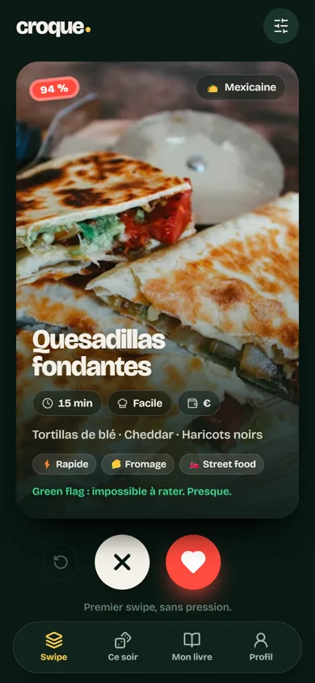
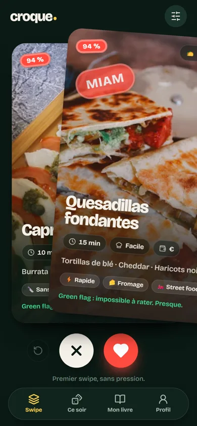
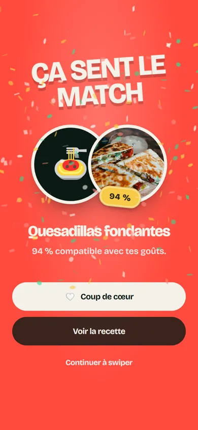
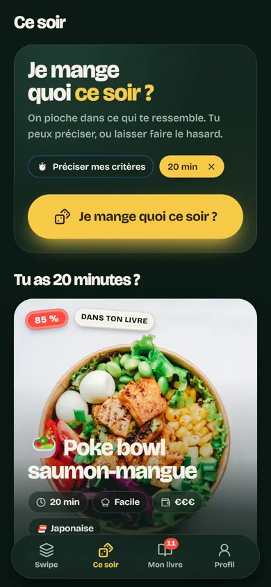
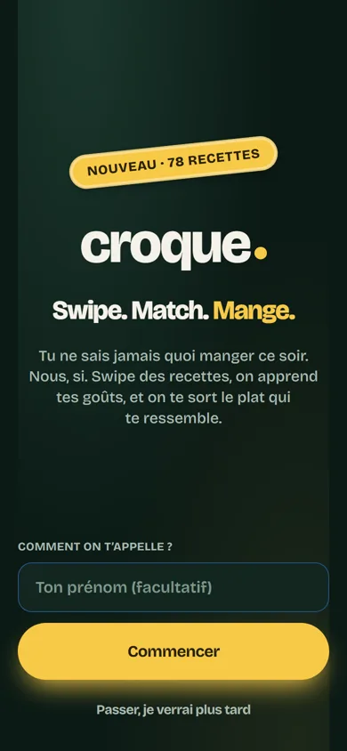
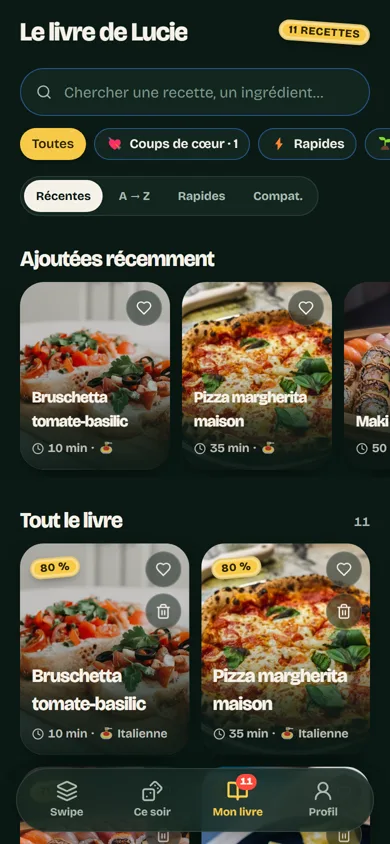
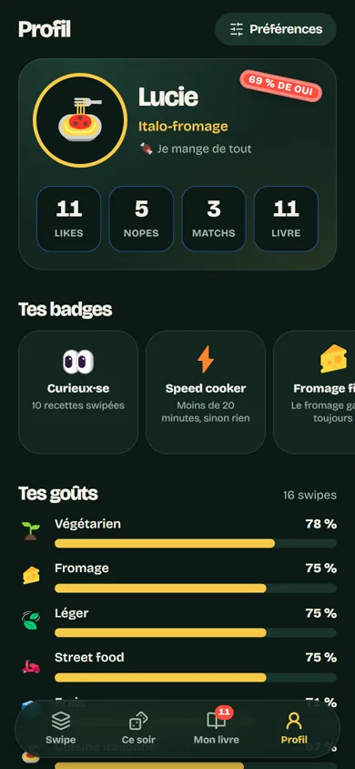
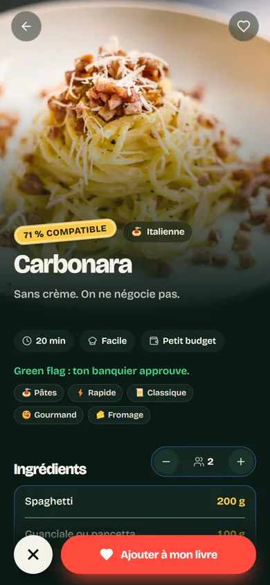

# 🍴 Croque — Swipe. Match. Mange.

[](https://github.com/Lucas-lux/croque/actions/workflows/ci.yml)
[](LICENSE)

Une app mobile-first façon Tinder, mais pour les recettes. Tu swipes, elle apprend tes goûts,
elle remplit ton livre de recettes et elle répond à la seule question qui compte :
**« Je mange quoi ce soir ? »**

<p align="center">
  
  
  
  
</p>
<p align="center">
  
  
  
  
</p>

## Lancer en local

```bash
npm install
npm run dev        # http://localhost:5173
npm run build      # type-check + bundle dans dist/
npm run preview    # sert le build
```

Node 20 ou plus. Le serveur de dev écoute aussi sur le réseau local : ouvre l'URL « Network » sur ton téléphone.
Sur desktop, l'app s'affiche dans une colonne de largeur téléphone.

Raccourcis clavier sur l'écran Swipe : `←` nope, `→` like, `↑` ouvrir la recette, `⌫` annuler.

## Déployer

Le projet est prêt pour [Vercel](https://vercel.com) : importe le repo, le preset Vite est détecté,
`vercel.json` gère les réécritures du routeur et le cache des polices. Aucune variable d'environnement,
aucun backend. Ça marche aussi sur Netlify, Cloudflare Pages ou n'importe quel hébergeur statique
qui redirige toutes les routes vers `index.html`.

## Ce que fait la V1

- **Onboarding** en 6 étapes (cuisines, aliments bannis, régime, allergies, niveau + temps, budget + envies), skippable, modifiable dans *Préférences*.
- **Swipe** : cartes photo plein format, drag avec rotation, stickers MIAM / NOPE, boutons, undo, flags humoristiques. Un sélecteur **Tout / Plats / Desserts** en tête d'écran filtre le deck ; chaque recette est catégorisée plat ou dessert.
- **Apprentissage** : chaque swipe met à jour un profil d'affinités par feature (cuisine, type de plat, tags, protéines, temps, difficulté, coût). Le deck est re-classé après chaque swipe, avec un peu d'exploration pour continuer à apprendre.
- **Match** : un like sur une recette ≥ 90 % de compatibilité déclenche l'écran « It's a match » (confettis, coup de cœur).
- **Mon livre** : toutes les recettes likées, séparées en **Plats** et **Desserts** (avec compteurs), recherche, filtres (coups de cœur, rapides, végé, cuisines), tri, suppression en deux temps.
- **Je mange quoi ce soir ?** : choix **Plat / Dessert / Les deux** (plat par défaut), puis tirage pondéré parmi les recettes compatibles, avec critères facultatifs (temps, budget, personnes, envie, ingrédients du frigo).
- **Profil** : stats, type culinaire, barres de goûts, badges, coups de cœur, résumé des préférences, remise à zéro.

187 recettes en français, 54 cuisines sur 5 continents (Afrique de l'Ouest et de l'Est, Maghreb, Amérique latine et Caraïbes, toute l'Europe, Asie du Sud-Est, Moyen-Orient…), avec ingrédients quantifiés (mis à l'échelle selon le nombre de personnes) et étapes. Le sélecteur de cuisines de l'onboarding est groupé par continent, avec un bouton « Toutes » par région.

## Architecture

```
src/
  domain/               logique pure, sans React
    types.ts            Recipe, UserPreferences, SwipeEvent, TasteProfile…
    taxonomy.ts         54 cuisines groupées par continent, tags, régimes, allergènes, libellés
    copy.ts             ton de l'app : flags, punchlines, titres de match
    badges.ts           badges calculés
    recommendation/
      features.ts       recette → features pondérées
      profile.ts        swipes → profil d'affinités (lissage, récence, confiance)
      scoring.ts        exclusions dures, score explicite + appris, % de compatibilité, seuil de match
      recommender.ts    construction du deck (classement + exploration + diversité)
      tonight.ts        « Je mange quoi ce soir ? »
  data/                 catalogue (187 recettes, 7 fichiers par région) + photos.ts (photo par recette)
  services/             RecipeRepository (point d'extension : API, import URL, génération)
  store/                Zustand + persistance localStorage : prefs, swipes, livre
  hooks/                useDeck, useTasteProfile, useToast, haptics
  components/           ui (Button, Chip, Sticker, MetaPill, SmartImage…) et layout (Screen, BottomNav)
  features/             un dossier par écran : onboarding, discover, recipe, book, tonight, profile, preferences
```

Les trois stores sont indépendants et sérialisables : brancher une synchro cloud revient à remplacer
le `storage` de `persist`. Le recommender ne dépend que des types du domaine : il peut être remplacé
par un modèle sans toucher à l'UI. Le contexte produit est dans `PRODUCT.md`, le système visuel dans `DESIGN.md`.

## Comment marche la recommandation

1. Chaque recette est décrite par des features pondérées (`cuisine:italian` ×3, `kind:meat` ×2, `tag:spicy` ×1.4…).
2. Chaque like / nope incrémente les compteurs des features de la recette (les swipes récents pèsent plus).
3. L'affinité d'une feature = (likes + 1) / (likes + dislikes + 2) : elle démarre à 50 % et converge vers le vrai ratio.
4. Score appris = moyenne pondérée des affinités. Score explicite = préférences de l'onboarding.
5. Les deux sont mélangés selon la confiance (nombre de swipes, pleine à 16), puis étirés en « % compatible ».
6. Allergies, régime et aliments bannis excluent définitivement.

## Feuille de route (pistes)

IA pour affiner les recommandations, génération de recettes, analyse du frigo en photo, liste de courses,
comptes et synchro cloud, partage, suggestions de saison, import de recettes depuis une URL.
L'architecture laisse la place, rien de tout ça n'est commencé.

## Contribuer

Voir [CONTRIBUTING.md](CONTRIBUTING.md). Une recette de plus est toujours bienvenue.

## Crédits

Photos : [Unsplash](https://unsplash.com), [Pexels](https://www.pexels.com) et [TheMealDB](https://www.themealdb.com), utilisées sous leurs licences libres respectives.
Police : [Bricolage Grotesque](https://github.com/ateliertriay/bricolage) (SIL Open Font License), auto-hébergée.
Icônes : [Lucide](https://lucide.dev). Confettis : [canvas-confetti](https://github.com/catdad/canvas-confetti).

Stack : React 18, TypeScript, Vite, Tailwind, Framer Motion, Zustand, React Router.

## Licence

[MIT](LICENSE)
